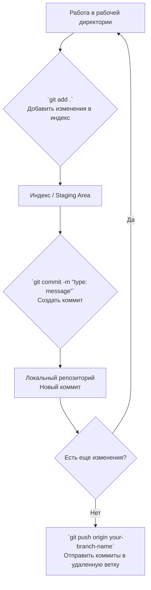

# Инструкция по работе с Git

Добро пожаловать в проект! Этот документ поможет вам разобраться с основами рабочего процесса в нашем репозитории.

## 📁 Структура репозитория

*   `main` — главная ветка. Сюда попадает только проверенный, стабильный код. **Прямые пуши в `main` запрещены.**
*   `develop` — ветка разработки. Здесь интегрируются новые функции и исправления перед выпуском.
*   `feature/*` — ветки для разработки новых функций (фич). Создаются от `develop`.
*   `fix/*` — ветки для исправления багов. Создаются от `develop`.
*   `hotfix/*` — ветки для срочных исправлений в `main`. Создаются от `main`.

## 👨‍💼 Код-ревью

**Важное правило:** Все ваши Merge Request (MR) / Pull Request (PR) будут проверять только я, **Иван (тимлид)**. После того как вы завершили работу в своей ветке и создали MR, напишите мне в общий чат, что работа готова к проверке.

## 🚀 Основной рабочий процесс

### 1. Начало работы над новой задачей

Всегда начинайте с актуальной версии `develop`.

```bash
# Переключиться на ветку develop
git checkout develop

# Получить последние изменения из удаленного репозитория
git pull origin develop

# Создать и переключиться на новую ветку для вашей задачи
# Для новой функции используйте префикс feature/
git checkout -b feature/awesome-new-button
# Или для исправления бага используйте префикс fix/
git checkout -b fix/login-form-error
```

### 2. Регулярно делайте коммиты

Делайте коммиты часто, каждый раз, когда вы завершаете небольшой логический этап работы. Это помогает сохранять вашу работу и делает историю проекта понятнее.

Соглашение о коммитах
Мы используем условные обозначения в начале сообщения коммита, чтобы быстро понимать его суть.

Префикс	Назначение	Пример сообщения коммита
feat:	Добавление новой функциональности (feature).	feat: add user profile page
fix:	Исправление ошибки (bug fix).	fix: correct email validation logic
debug:	Отладочные изменения (не влияют на логику). Например, добавление логов.	debug: add console log for api response
docs:	Изменения в документации.	docs: update API usage examples in README
style:	Изменения, не влияющие на смысл кода (форматирование, пробелы, точки с запятой).	style: format code according to linter rules
refactor:	Рефакторинг кода без исправления багов и без добавления новых функций.	refactor: simplify data processing function
chore:	Вспомогательные задачи (обновление пакетов, настройка инструментов).	chore: update dependencies to late

#### Примеры команд
``` bash
# Добавили новую функцию
git add .
git commit -m "feat: implement user registration form"

# Позже нашли и исправили в ней баг
git add .
git commit -m "fix: handle empty email field in registration form"

# Добавили логи для отладки
git add .
git commit -m "debug: log registration request payload"
```

#### Логика создания коммита


### 3. Отправка вашей работы на сервер

Пушьте изменения только в свои ветки. Это ключевое правило.

```bash
# Отправить вашу ветку в удаленный репозиторий (в первый раз)
git push -u origin feature/awesome-new-button

# Все последующие пуши в эту же ветку
git push
```

### 4. Процесс слияния (Merge Process)
Завершите работу в своей ветке, сделали все коммиты и запушили их.

На GitHub/GitLab создайте Merge Request (MR) из вашей ветки (например, feature/awesome-new-button) в ветку develop.

В описании MR четко укажите:

Что было сделано?

Как это проверить?

Напишите мне в чат, что MR готов к проверке.

Я (Иван) проведу код-ревью. Если будут замечания, я оставлю комментарии в MR. Вам нужно будет внести правки в ту же ветку и снова сделать git push.

После одобрения я сам выполню слияние вашего MR с веткой develop.

❌ Чего делать не стоит
Не работать прямо в ветках main или develop. Всегда создавайте свою ветку.

Не пушить прямо в main или develop. Это вызовет ошибку.


Не забывать писать понятные сообщения коммитов. Сообщение "fix" ни о чем не говорит.

Не делать огромные коммиты, в которых смешаны и новая функциональность, и исправления стиля. Дробите изменения на логические части.

# Важно!!!

Нужно создавать файл requrements.txt со списком необходимых библиотек

Если вы работаете в .ipynb для кажой ветки - создавать отдельный файл
