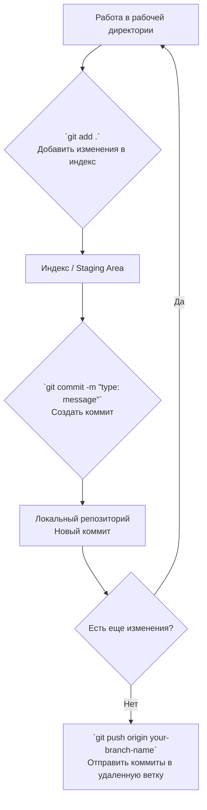

# Что было сделано?

## Модель CNN+LSTM
Была написана модель CNN+LSTM
Добавлены матрица ошибок и нормализованная матрица.
Была достигнута точность accuracy 0.6912 для 10 классов, которые были взяты из файла Analiz_dataset
Входе анализа предсказания модели был сделан вывод, что надо объядинить классы C34.1 и C34.3, т.к. их признаки слишком похожи, и из-за этого падает точность


## Модель случайный лес
Была написана модель случайный лес.

Объеденно несколько классов в один. В ходе обучения, если значение класса < 10, то не рассматривался. По итогу было рассмотрено 10 классов.
A15: Туберкулёз органов дыхания
C34: Злокачественные новообразования лёгких
D14: Доброкачественные опухоли дыхательных органов
J12: Вирусная пневмония
J15: Бактериальная пневмония
J18: Пневмония неуточнённая
J41: Простой хронический бронхит
J44: Хроническая обструктивная болезнь лёгких (ХОБЛ)
J45: Бронхиальная астма
U07: COVID-19

Добавлены матрица ошибок и нормализованная матрица.

Была достигнута точность accuracy 0.9310.


## Прасинг

Данные были распаршены, записаны в JSON файл

Были отделены текстовые и числовые переменные.

## Анализ датасета

Был проведён анализ датасета на предмет выбросов и пропусков, и убраны числовые переменные, где больше 20% пропусков или больше 15% Выбросов.

Был проанализирован баланс классов в результате исследование было установлено, что многие диагнозы встречаются 1-5 раз, и на нет смысла обучать, было принято решение взять топ 7 самых частых диагнозов:
 1. J44.8 - 204 случаев (  10.1%)
 2. D14.3 - 185 случаев (   9.2%)
 3. U07.1 - 167 случаев (   8.3%)
 4. A15.0 - 163 случаев (   8.1%)
 5. C34.1 - 155 случаев (   7.7%)
 6. C34.3 - 119 случаев (   5.9%)
 7. J44.1 - 118 случаев (   5.9%)

### Результаты анализа баланса 

Для топ 7 диагнозов был проведён анализ баланса


Классификация классов:
Мажоритарные классы (>1.5x среднего): 0
Миноритарные классы (<0.5x среднего): 0

Сильно дисбаланса нет - `Можно работать с этими данными`

## Подготовка данных для CatBoost

### Основные этапы обработки данных

#### 1. Создание функций для анализа текста
`count_symptoms(text)` - подсчитывает количество уникальных симптомов в тексте
`count_medical_terms(text)` - подсчитывает количество медицинских терминов

#### 2. Функция `prepare_catboost_features(df)` - основная функция подготовки признаков
Категории создаваемых признаков:

1. **Числовые витальные признаки** (7 признаков)  
   - Температура тела  
   - Артериальное давление (систолическое и диастолическое)  
   - Частота сердечных сокращений  
   - Пульс  
   - Сатурация  
   - Частота дыхания  

2. **Лабораторные показатели** (5 признаков)  
   - Гематокрит крови  
   - Лейкоциты  
   - Нейтрофилы  
   - Белок общий  
   - Глюкоза  

3. **Текстовые признаки**  
   - Плотность симптомов — отношение количества симптомов к длине текста  
   - Плотность медицинских терминов — отношение медицинских терминов к длине текста  

4. **Симптомы из жалоб** (10 бинарных признаков)  
   - Лихорадка (`fever`)  
   - Кашель (`cough`)  
   - Одышка (`breathlessness`)  
   - Боль в груди (`chest_pain`)  
   - Слабость (`weakness`)  
   - Головная боль (`headache`)  
   - Тошнота (`nausea`)  
   - Хрипы (`wheezing`)  
   - Мокрота (`sputum`)  
   - Насморк (`rhinitis`)  

5. **Комбинированные синдромы** (2 признака)  
   - Респираторный синдром (сумма: кашель + одышка + хрипы)  
   - Воспалительный синдром (сумма: лихорадка + слабость)  

6. **Признаки из анамнеза** (6 бинарных признаков)  
   - Курение  
   - Хронические заболевания легких  
   - Гипертония  
   - Диабет  
   - Сердечные заболевания  
   - Аллергии  

7. **Признаки из физикального обследования** (5 бинарных признаков)  
   - Хрипы при аускультации  
   - Крепитация  
   - Цианоз  
   - Отеки  
   - Тахикардия  

8. **Сводные метрики** (3 признака)  
   - Общее количество симптомов  
   - Общее количество факторов из анамнеза  
   - Общее количество находок при обследовании  

#### 3. Фильтрация данных
Отбираются только топ-10 самых частых диагнозов для повышения устойчивости модели
Создается отфильтрованный датафрейм с признаками и целевой переменной

## Обучение модели

### Настройки CatBoostClassifier
- **Задача**: многоклассовая классификация (`loss_function='MultiClass'`)
- **Метрика оценки**: `Accuracy` (`eval_metric='Accuracy'`)
- **Ранняя остановка**: `early_stopping_rounds=5000`
- **Максимальное число итераций**: 15 000
- **Гиперпараметры**:
  - `learning_rate=0.08`
  - `depth=6`
  - `random_state=42`
- **Использование лучшей модели**: `use_best_model=True`

### Результаты обучения
- **Лучшая итерация**: **459**
- **Точность на тестовой выборке**: **73.47%**


## Оценка качества модели

### Важность признаков (ТОП-5)
1. `Частота дыхания`  
2. `symptom_density` (плотность симптомов в тексте жалоб)  
3. `Температура тела`  
4. `Лейкоциты`  
5. `Сатурация`  

### Метрики по классам (F1-score)
| Диагноз | F1-score |
|--------|----------|
| ХОБЛ | **0.90** |
| COVID-19 | **0.95** |
| Неаллергическая астма | **0.82** |
| Туберкулёз (подтверждённый) | **0.75** |
| Бактериальные пневмонии | **0.80** |
| Доброкачественные опухоли | **0.82** |
| Астма неуточнённая | **0.75** |
| Туберкулёз (без подтверждения) | **0.76** |
| Опухоль верхней доли | **0.48** |
| Опухоль нижней доли | **0.48** |

### Матрица ошибок 

| Истинный класс \ Предсказанный | 1 | 2 | 3 | 4 | 5 | 6 | 7 | 8 | 9 | 10 |
|---|---|---|---|---|---|---|---|---|---|---|
| **1** | 0.97 | 0.00 | 0.00 | 0.00 | 0.00 | 0.00 | 0.03 | 0.00 | 0.00 | 0.00 |
| **2** | 0.00 | 0.50 | 0.07 | 0.36 | 0.00 | 0.00 | 0.04 | 0.00 | 0.00 | 0.04 |
| **3** | 0.00 | 0.14 | 0.79 | 0.04 | 0.00 | 0.04 | 0.00 | 0.00 | 0.00 | 0.00 |
| **4** | 0.00 | 0.39 | 0.09 | 0.48 | 0.00 | 0.00 | 0.04 | 0.00 | 0.00 | 0.00 |
| **5** | 0.00 | 0.00 | 0.00 | 0.00 | 1.00 | 0.00 | 0.00 | 0.00 | 0.00 | 0.00 |
| **6** | 0.06 | 0.00 | 0.00 | 0.06 | 0.12 | 0.75 | 0.00 | 0.00 | 0.00 | 0.00 |
| **7** | 0.00 | 0.21 | 0.00 | 0.00 | 0.00 | 0.00 | 0.79 | 0.00 | 0.00 | 0.00 |
| **8** | 0.36 | 0.00 | 0.00 | 0.00 | 0.00 | 0.00 | 0.64 | 0.00 | 0.00 | 0.00 |
| **9** | 0.00 | 0.08 | 0.23 | 0.00 | 0.00 | 0.08 | 0.00 | 0.00 | 0.62 | 0.00 |
| **10** | 0.00 | 0.00 | 0.22 | 0.00 | 0.00 | 0.00 | 0.00 | 0.00 | 0.00 | 0.78 |


Соответствие классов диагнозам

- **Класс 1**: Другая уточненная хроническая обструктивная легочная болезнь
- **Класс 2**: Злокачественное новообразование верхней доли, бронхов или легкого
- **Класс 3**: Туберкулез легких, подтвержденный бактериоскопически с наличием или отсутствием роста культуры
- **Класс 4**: Злокачественное новообразование нижней доли, бронхов или легкого
- **Класс 5**: COVID-19, вирус идентифицирован
- **Класс 6**: Другие бактериальные пневмонии
- **Класс 7**: Доброкачественное новообразование бронха и легкого
- **Класс 8**: Астма неуточненная
- **Класс 9**: Туберкулез легких при отрицательных результатах бактериологических и гистологических исследований
- **Класс 10**: Неаллергическая астма


# Инструкция по работе с Git

Добро пожаловать в проект! Этот документ поможет вам разобраться с основами рабочего процесса в нашем репозитории.

## 📁 Структура репозитория

*   `main` — главная ветка. Сюда попадает только проверенный, стабильный код. **Прямые пуши в `main` запрещены.**
*   `develop` — ветка разработки. Здесь интегрируются новые функции и исправления перед выпуском.
*   `feature/*` — ветки для разработки новых функций (фич). Создаются от `develop`.
*   `fix/*` — ветки для исправления багов. Создаются от `develop`.
*   `hotfix/*` — ветки для срочных исправлений в `main`. Создаются от `main`.

## Начало работы

* `Для новой ветки` - создаётся своё вирутальное окружение в Powershell

```bash
python -m venv .venv
```
.venv - это название вируатльного оркужения его можно изменить на нужное

Производим активацию окржуения
```bash
cd repo[тут ваша папка]
.venv\Scripts\Activate.ps1
```

После этого устанавливаем нужные библиотеки

## 👨‍💼 Код-ревью

**Важное правило:** Все ваши Merge Request (MR) / Pull Request (PR) будут проверять только я, **Иван (тимлид)**. После того как вы завершили работу в своей ветке и создали MR, напишите мне в общий чат, что работа готова к проверке.

## 🚀 Основной рабочий процесс

### 1. Начало работы над новой задачей

Всегда начинайте с актуальной версии `develop`.

```bash
# Переключиться на ветку develop
git checkout develop

# Получить последние изменения из удаленного репозитория
git pull origin develop

# Создать и переключиться на новую ветку для вашей задачи
# Для новой функции используйте префикс feature/
git checkout -b feature/awesome-new-button
# Или для исправления бага используйте префикс fix/
git checkout -b fix/login-form-error
```

### 2. Регулярно делайте коммиты

Делайте коммиты часто, каждый раз, когда вы завершаете небольшой логический этап работы. Это помогает сохранять вашу работу и делает историю проекта понятнее.

Соглашение о коммитах
Мы используем условные обозначения в начале сообщения коммита, чтобы быстро понимать его суть.

Префикс	Назначение	Пример сообщения коммита
feat:	Добавление новой функциональности (feature).	feat: add user profile page
fix:	Исправление ошибки (bug fix).	fix: correct email validation logic
debug:	Отладочные изменения (не влияют на логику). Например, добавление логов.	debug: add console log for api response
docs:	Изменения в документации.	docs: update API usage examples in README
style:	Изменения, не влияющие на смысл кода (форматирование, пробелы, точки с запятой).	style: format code according to linter rules
refactor:	Рефакторинг кода без исправления багов и без добавления новых функций.	refactor: simplify data processing function
chore:	Вспомогательные задачи (обновление пакетов, настройка инструментов).	chore: update dependencies to late

#### Примеры команд
``` bash
# Добавили новую функцию
git add .
git commit -m "feat: implement user registration form"

# Позже нашли и исправили в ней баг
git add .
git commit -m "fix: handle empty email field in registration form"

# Добавили логи для отладки
git add .
git commit -m "debug: log registration request payload"
```

#### Логика создания коммита


### 3. Отправка вашей работы на сервер

Пушьте изменения только в свои ветки. Это ключевое правило.

```bash
# Отправить вашу ветку в удаленный репозиторий (в первый раз)
git push -u origin feature/awesome-new-button

# Все последующие пуши в эту же ветку
git push
```

### 4. Процесс слияния (Merge Process)
Завершите работу в своей ветке, сделали все коммиты и запушили их.

На GitHub/GitLab создайте Merge Request (MR) из вашей ветки (например, feature/awesome-new-button) в ветку develop.

В описании MR четко укажите:

Что было сделано?

Как это проверить?

Напишите мне в чат, что MR готов к проверке.

Я (Иван) проведу код-ревью. Если будут замечания, я оставлю комментарии в MR. Вам нужно будет внести правки в ту же ветку и снова сделать git push.

После одобрения я сам выполню слияние вашего MR с веткой develop.

`ВАЖНО` нужно используя команду

```bash
pip freeze
```
Заполнить файл requrements.txt и залить его в свою ветку

❌ Чего делать не стоит
Не работать прямо в ветках main или develop. Всегда создавайте свою ветку.

Не пушить прямо в main или develop. Это вызовет ошибку.

Не забывать писать понятные сообщения коммитов. Сообщение "fix" ни о чем не говорит.

Не делать огромные коммиты, в которых смешаны и новая функциональность, и исправления стиля. Дробите изменения на логические части.


